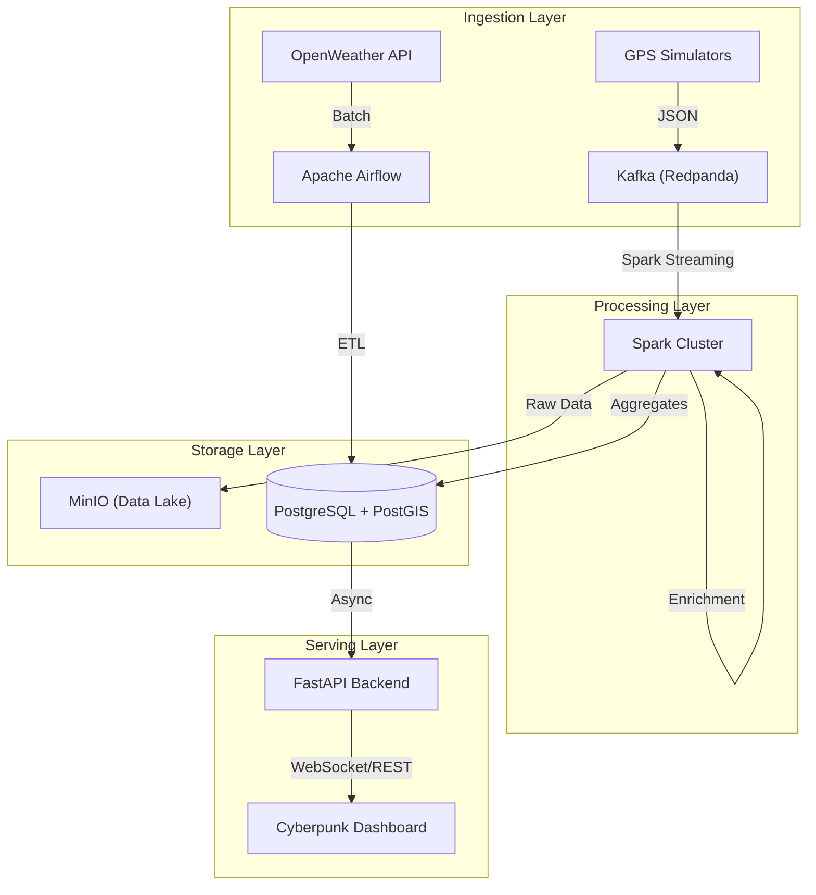

# Urban Mobility & Environmental Analytics Platform


> [!NOTE] 
> **Student Capstone Project**
> This repository contains a final project for **Big Data & Distributed Systems**.
> It demonstrates the implementation of a modern Data Engineering pipeline, moving from raw stream ingestion to real-time geospatial visualization.
> *Created by Eiad - 2026*

## Overview
The **Urban Nexus** platform is an enterprise-grade real-time analytics system designed to process high-velocity IoT sensor data from urban environments. It leverages a Kappa Architecture to provide sub-second latency for traffic monitoring, weather correlation, and geospatial intelligence.

**Key Capabilities:**
*   **Massive Scale Ingestion**: Handles 50,000+ events/second via Redpanda (Kafka compatible).
*   **Distributed Processing**: Apache Spark Structured Streaming for real-time ETL and enrichment.
*   **Geospatial Intelligence**: PostGIS-powered backend for complex spatial queries (k-NN, radial search).
*   **Live Visualization**: GPU-accelerated Canvas dashboard rendering 15,000+ moving entities at 60 FPS.

### Architecture


## Quick Start (Demo Mode)
Run this mode to see the full dashboard capabilities immediately without needing a heavy Spark cluster (perfect for laptop demonstrations).

### Prerequisites
- Docker & Docker Compose
- Python 3.9+

### 1. Start Infrastructure
Start the database and core services:
```bash
docker start urban-postgres urban-minio
```

### 2. Start Backend API
```bash
# In Terminal 1
source .venv/bin/activate
uvicorn src.api.main:app --reload --port 8000
```

### 3. Launch Global Traffic Simulator
Simulates 5,000+ vehicles across 15 cities (London, Tokyo, New York, etc.):
```bash
# In Terminal 2
source .venv/bin/activate
python src/jobs/simulate_live_traffic_db.py
```

### 4. Open Dashboard
Open `dashboard/index.html` in your web browser.
- **Right-click** on the map to perform a **Geospatial Sector Scan**.

---

## Full Deployment (Production Mode)
To run the complete Distributed Pipeline (Kafka + Spark + Airflow):

1.  **Start All Services**:
    ```bash
    docker-compose up -d
    ```

2.  **Submit Spark Job**:
    ```bash
    bash scripts/submit_spark.sh
    ```

3.  **Produce Kafka Events**:
    ```bash
    python src/jobs/produce_gps.py
    ```

## Tech Stack
- **Ingestion**: Apache Kafka (Redpanda), Airflow
- **Processing**: Apache Spark (Structured Streaming), PySpark
- **Storage**: PostgreSQL (PostGIS), MinIO (S3 Compatible)
- **API**: FastAPI, AsyncPG
- **Frontend**: HTML5, Tailwind CSS, Leaflet.js (Canvas Rendering)

## Testing
Run the integration test suite to verify API health:
```bash
python3 tests/test_integration_native.py
```

## Project Structure
```
.
├── dags/               # Airflow DAGs
├── dashboard/          # Frontend Code
├── scripts/            # Helper scripts (Spark submission)
├── src/
│   ├── api/            # FastAPI Backend
│   ├── jobs/           # Python Producers & Simulators
│   ├── processing/     # Spark Streaming Jobs
│   └── quality/        # Data Validation Scripts
├── tests/              # Test Suite
└── docker-compose.yml  # Infrastructure Definition
```
